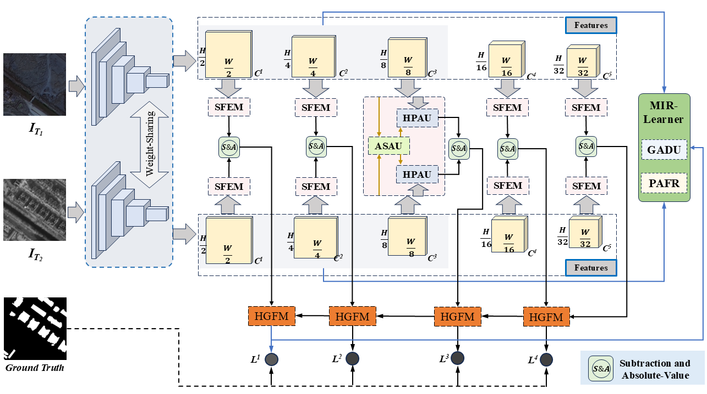
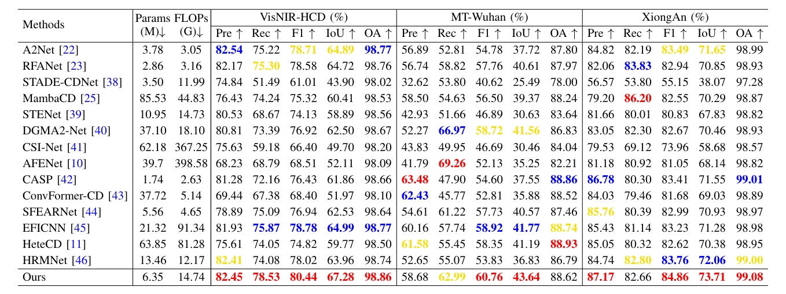

# <p align=center>`ASFR-Net: Adversarial Alignment and Spatio-Frequency Refinement Network for Heterogeneous Remote Sensing Image Change Detection`</p>

> **Authors:**
Xin-Jie Wu, Zhi-Hui You, Si-Bao Chen, Qing-Ling Shu, Xiao Wang, Jin Tang, and Bin Luo

This repository contains the official PyTorch implementation of our paper **ASFR-Net**.

### 1. Overview

<p align="center">
     <br />
</p>

ASFR-Net is an end-to-end adversarial spatio-frequency refinement network. It bridges the modality gap via a **Modality-Invariant Representation Learner (MIR-Learner)**, suppresses sensor-specific noise using a **Spatio-Frequency Synergistic Enhancement Module (SFEM)**, and generates precise change maps through a decoder equipped with **Hierarchical Guided Fusion Module (HGFM)** blocks.

### 2. Usage
+ **Prepare the dataset:**
    - Download our **VisNIR-HCD** dataset: [Google Drive](https://drive.google.com/file/d/14iPPW7LftMqI5vis2px0PmLJqc9L9Xum/view?usp=drive_link)
    - Organize the dataset directory as follows:
    ```
    ├─VisNIR-HCD
        ├─label       ...png (Change masks)
        ├─list        ...txt (Train/Val/Test splits)
        ├─NIR_A       ...png (NIR images at T1/T2)
        ├─NIR_B       ...png
        ├─RGB_A       ...png (Visible images at T1/T2)
        └─RGB_B       ...png
    ```

+ **Prerequisites:**
    - Create a virtual environment: `conda create -n ASFRNet python=3.8`
    - Install dependencies: `pip install -r requirements.txt`

+ **Clone this repo:**
    ```shell
    git clone https://github.com/LuoYang2024/ASFR-Net.git
    cd ASFR-Net
    ```
    
+ **Train/Test:**
    - To train the model: `python ./tools/train.py`
    - To test the model: `python ./tools/test.py`

### 3. Change Detection Results
<p align="center">
     <br />
    <em> 
    Quantitative comparisons on VisNIR-HCD, MT-Wuhan, and XiongAn datasets. ASFR-Net consistently outperforms existing SOTA methods in F1-score and IoU.
    </em>
</p>

### 4. Checkpoints on Datasets

Our trained pth on VisNIR_HCD: [Download](https://github.com/LuoYang2024/ASFR-Net/tree/main/checkpoints/VisNIR_HCD_best_model_G_8044.pth)

Our trained pth on MT_Wuhan: [Download](https://github.com/LuoYang2024/ASFR-Net/tree/main/checkpoints/MT_Wuhan_best_model_G_6076.pth)

Our trained pth on XiongAn: [Download](https://github.com/LuoYang2024/ASFR-Net/tree/main/checkpoints/XiongAn_best_model_G_8486.pth)

### 5. Acknowledgment
This repository is built under the help of the projects  [A2Net](https://github.com/guanyuezhen/A2Net) and [RFANet](https://github.com/Youzhihui/RFANet) for academic use only.

### 6. Citation

Please cite our paper if you find this work or the dataset useful:

```bibtex
@article{Wu2026_ASFRNet,
  title={ASFR-Net: Adversarial Alignment and Spatio-Frequency Refinement Network for Heterogeneous Remote Sensing Image Change Detection},
  author={Wu, Xin-Jie and You, Zhi-Hui and Chen, Si-Bao and Shu, Qing-Ling and Wang, Xiao and Tang, Jin and Luo, Bin},
  journal={IEEE Transactions on Geoscience and Remote Sensing},
  year={2026},
  doi={10.1109/TGRS.2026.xxxxxxx}
}
